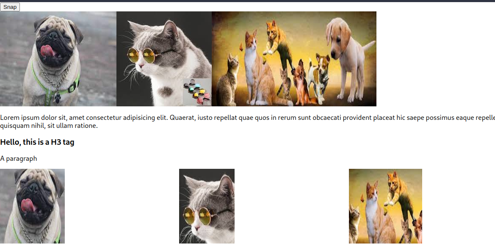
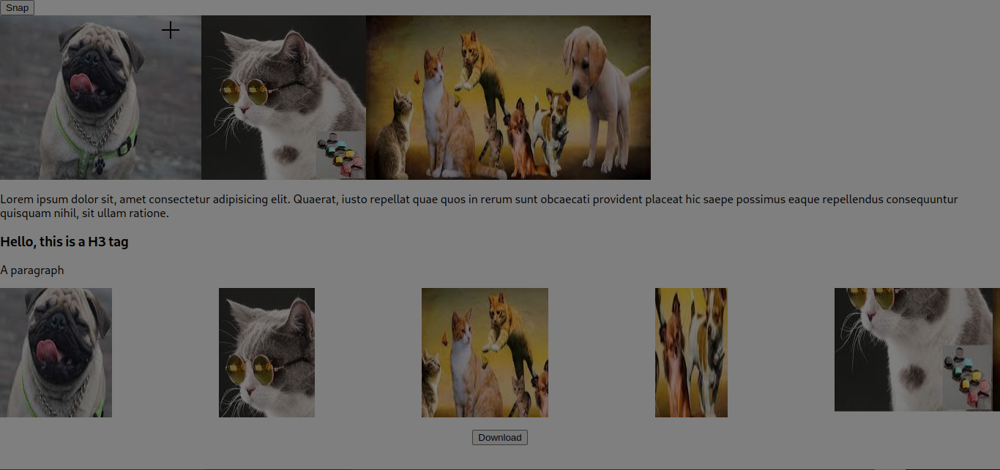

# screen-snip

## Examples 






```javaScript
import logo from './logo.svg';
import './App.css';
import {ScreenSnip} from 'screen-snip'
import { useState } from 'react';

function App() {
  const [images, setImages] = useState([])

  const handleScreenCapture = screenCapture => {
    setImages([...images, screenCapture])
  };
  return (
    <ScreenSnip endCapture={handleScreenCapture}>
      {({ capture }) => (
        <div>
          <button onClick={capture}>Snap</button>

          <div style={{ display: "flex" }}>

            
            
            


          </div>
          <p>
            Lorem ipsum dolor sit, amet consectetur adipisicing elit. Quaerat, iusto
            repellat quae quos in rerum sunt obcaecati provident placeat hic saepe
            possimus eaque repellendus consequuntur quisquam nihil, sit ullam
            ratione.
          </p>
          <div id="content">
            <h3>Hello, this is a H3 tag</h3>

            <p>A paragraph</p>
          </div>
          <div id="editor"></div>
          <center>
            <div id="divToPrint" style={{display:"flex", justifyContent:"space-between"}}>
              {images.map((image) => (
                
              ))}
            </div>

            <p>
              {images && <button>Download</button>}
            </p>
          </center>
        </div>
      )}


    </ScreenSnip>
  );
}

export default App;

````


<span style="color:red">Usage</span>


```javaScript

import {ScreenSnip} from 'screen-snip'

```

After importing ScreenSnip use the methods capture and endCapture showing in the example above


<table>
  <tr>
    <th>Argument</th>
    <th>Description</th>
  </tr>
  <tr>
    <td>capture</td>
    <td>To start snip the screen</td>
  </tr>
  <tr>
    <td>endCapture</td>
    <td>returns base64 of the snip</td>
  </tr>
</table>

## ⚖️ License

The MIT License [](https://opensource.org/licenses/MIT)